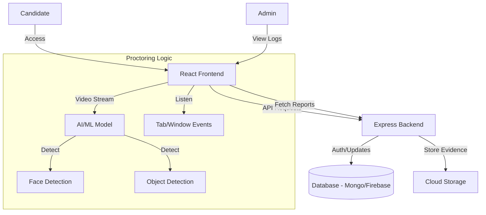

# AI-Powered Proctoring System (MVP)

> **A secure, scalable, and intelligent automated proctoring solution designed for seamless online assessments.**

[](https://proctor-g1yd.onrender.com/)
[](https://github.com/Sakshi443/ProctoringSystem)
[](https://opensource.org/licenses/MIT)

---

## 📖 Overview

The **AI-Powered Proctoring System** is a robust web application designed to maintain the integrity of online examinations. By leveraging computer vision and real-time monitoring, it detects suspicious activities such as multiple faces, absence of the candidate, or unauthorized object usage.

This project represents a **Minimum Viable Product (MVP)** that demonstrates a production-ready architecture, clean code practices, and a scalable tech stack suitable for real-world deployment.

### 🎯 Aim of the MVP
To provide a secure, browser-based proctoring environment that eliminates the need for intrusive desktop software while ensuring high accuracy in fraud detection.

### 🚀 Core Features
- **Real-Time Face Detection**: Monitors the candidate's presence and focus.
- **Multi-Person Detection**: Flags incidents if more than one person is detected in the frame.
- **Tab Switching Alerts**: Detects and logs when a user switches tabs or minimizes the window.
- **Automated Snapshots**: Captures evidence at regular intervals or when suspicious activity is detected.
- **Admin Dashboard**: A centralized panel for reviewers to inspect logs and evidence.
- **Responsive Design**: optimized for laptops and desktops with a webcam.

### 💡 Problems It Solves
1.  **Cheating Mitigation**: Reduces the ease of malpractice in remote exams.
2.  **Remote Accessibility**: Allows candidates to take exams from anywhere without special hardware.
3.  **Proctor Efficiency**: Automates the monitoring process, allowing one human proctor to oversee hundreds of candidates.

---

## 🏗️ Folder Structure (Ideal Production MVP)

This project follows a clean, modular structure separating concerns between the Client (Frontend) and Server (Backend).

```text
ProctoringSystem/
├── client/                     # Frontend Application (React.js)
│   ├── public/                 # Static assets (HTML, Favicons)
│   ├── src/
│   │   ├── assets/             # Images, icons, global styles
│   │   ├── components/         # Reusable UI components (Camera, AlertBox)
│   │   ├── pages/              # Page views (Dashboard, ExamPage, AdminPanel)
│   │   ├── hooks/              # Custom React hooks (useCamera, useProctor)
│   │   ├── services/           # API integration logic (api.js)
│   │   ├── context/            # Global state management
│   │   ├── utils/              # Helper functions (validators, formatters)
│   │   ├── App.js              # Main App component
│   │   └── index.js            # Entry point
│   ├── .env                    # Frontend environment variables
│   └── package.json            # Client dependencies
│
├── server/                     # Backend Application (Node.js/Express)
│   ├── config/                 # Configuration (DB, Cloudinary, Firebase)
│   ├── controllers/            # Request handlers (authController, examController)
│   ├── models/                 # Database schemas (User, Session, Log)
│   ├── routes/                 # API route definitions
│   ├── middlewares/            # Auth & validation middleware
│   ├── utils/                  # Utility functions (logger, errorHandling)
│   ├── app.js                  # Express app setup
│   ├── server.js               # Server entry point
│   ├── .env                    # Backend environment variables
│   └── package.json            # Server dependencies
│
└── README.md                   # Project documentation
```

---

## 🔄 Project Flow & Architecture

### High-Level Flow
`User` → `Frontend Interface` → `Webcam Stream` → `AI Analysis (Client/Server)` → `Backend API` → `Database` → `Admin Dashboard`

### Detailed Workflow
1.  **Authentication**: User logs in; JWT token issued.
2.  **Permission Grant**: User grants camera/microphone access.
3.  **Exam Session**:
    *   **Frontend**: Captures video feed using HTML5 Media API.
    *   **AI Engine**: lightweight models (e.g., TensorFlow.js or FaceAPI) run locally or frame data is sent to backend for analysis.
    *   **Event Listeners**: Detect `blur` (tab switch) and `resize` events.
4.  **Alert System**:
    *   If a violation (e.g., No Face) is detected → Red Alert on UI.
    *   Violation logged to Backend immediately.
5.  **Submission**: Exam data and proctoring logs are saved to the Database.

### Architecture Text-Diagram



---

## ⚙️ Technical Architecture

### Tech Stack
*   **Frontend**: React.js, Tailwind CSS (Styling), MediaPipe/TensorFlow.js (AI detection).
*   **Backend**: Node.js, Express.js.
*   **Database**: MongoDB / Firebase Firestore (for real-time logs).
*   **Storage**: Cloudinary / Firebase Storage (for violation snapshots).
*   **Deployment**: Vercel (Frontend), Render/Heroku (Backend).

### Key Modules
1.  **FaceTracker Module**: Uses computer vision to calculate head pose and face count.
2.  **ActivityLogger**: A middleware service that structures violation data before saving.
3.  **SessionManager**: Handles secure start/stop of exam timers and state.

---

## 🛠️ Installation & Setup

### Prerequisites
*   Node.js (v14+)
*   npm or yarn
*   A Cloud Database URI (MongoDB or Firebase)

### 1. Clone the Repository
```bash
git clone https://github.com/Sakshi443/ProctoringSystem.git
cd ProctoringSystem
```

### 2. Backend Setup
```bash
cd server
npm install
# Create a .env file and add your credentials:
# PORT=5000
# DB_URI=your_database_connection_string
# JWT_SECRET=your_secret_key
npm start
```

### 3. Frontend Setup
```bash
cd client
npm install
# Create a .env file:
# REACT_APP_API_URL=http://localhost:5000
npm start
```

The app should now be running at `http://localhost:3000`.

---

## 📡 API Endpoints (Core)

| Method | Endpoint | Description |
| :--- | :--- | :--- |
| `POST` | `/api/auth/login` | Authenticate user and receive token. |
| `POST` | `/api/exam/start` | Initialize a new proctoring session. |
| `POST` | `/api/log/violation` | Record a detected violation (tab switch, etc). |
| `POST` | `/api/upload/snapshot` | Upload a screenshot evidence of violation. |
| `GET` | `/api/admin/reports` | Fetch all session logs for the admin. |

---

## ✅ Before Submission Checklist

Use this checklist to ensure your MVP submission is perfect.

- [ ] **Demo is Live**: Verify the `onrender` link is active and accessible.
- [ ] **Clean Console**: Open DevTools (F12) in the browser and fix any red errors.
- [ ] **Env Variables**: Ensure `.env` is **NOT** committed to GitHub (use `.env.example`).
- [ ] **Responsive**: Test the exam page on different screen sizes.
- [ ] **Data Flow**: Verify that a "Tab Switch" actually saves a log in your specific database.
- [ ] **Code Formatting**: Run Prettier or a formatter on your code before the final commit.
- [ ] **License**: Ensure the MIT License is present in the repo.

---

## 📝 License

This project is licensed under the MIT License - see the [LICENSE](LICENSE) file for details.

---

*Developed by Sakshi Manoorkar*
