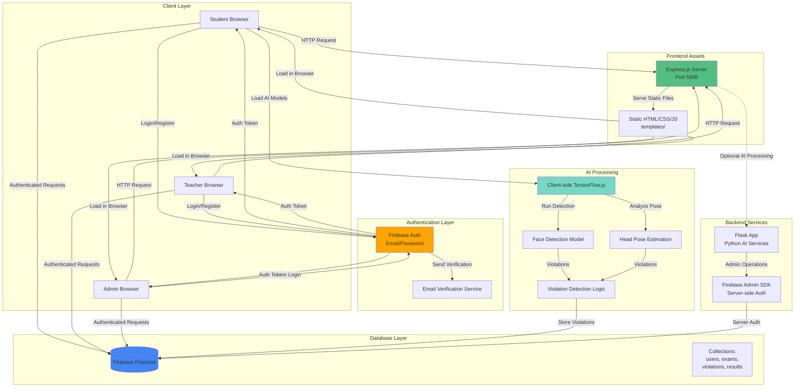
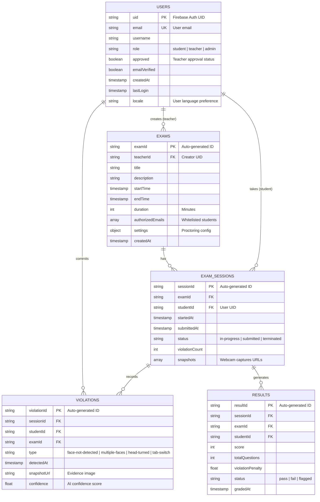
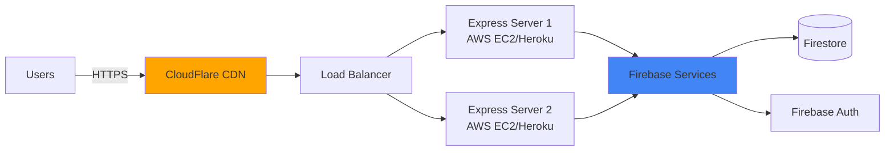

# 🏗️ System Design Document (SDD)
## Proctor (ExamSecure) - Automated Proctoring System

---

## 📋 Project Context

**Project Goal:** Build a scalable, AI-powered online exam proctoring system that prevents cheating through real-time monitoring and analysis.

**Expected Traffic:** 
- **Target Users:** 1,000-5,000 concurrent exam sessions
- **Daily Active Users:** ~10,000 students and educators
- **Peak Load:** During exam periods (semester finals, entrance tests)

**Constraints:**
- Must use **Firebase** for authentication and real-time database
- **Low latency required** for real-time face detection and monitoring
- **Client-side AI processing** to reduce server load
- **Role-based access control** (Student, Teacher, Admin)

---

## 1. 🎯 System Overview

### Architectural Pattern: **Hybrid Monolith with Microservice Elements**

**Justification:**

The Proctor system employs a **pragmatic hybrid architecture** that balances simplicity with scalability:

#### **Monolithic Components:**
- **Express.js Server** serves static frontend assets and handles routing
- **Flask Backend** (currently minimal) provides extensibility for Python-based AI processing
- Single deployment unit for ease of development and maintenance

#### **Microservice Elements:**
- **Firebase Authentication** - Decoupled identity management
- **Firebase Firestore** - Managed NoSQL database service
- **Client-side AI Processing** - Distributed computation (face detection, head pose estimation)

#### **Why This Pattern Fits:**

| Requirement | How Architecture Addresses It |
|:------------|:------------------------------|
| **Rapid Development** | Monolithic structure allows fast iteration for academic project |
| **Scalability** | Firebase handles auth/database scaling; client-side AI offloads server |
| **Real-time Monitoring** | Firestore real-time listeners + client-side processing = low latency |
| **Cost Efficiency** | Minimal server infrastructure; Firebase free tier for development |
| **Future Growth** | Flask backend ready for ML model serving if needed |

---

## 2. 🔄 Data Flow Architecture



### **Data Flow Explanation:**

1. **User Access:** Students/Teachers/Admins access the system via browser → Express server serves static assets
2. **Authentication:** Firebase Auth handles login, registration, email verification
3. **Role-Based Routing:** After auth, users are redirected to role-specific dashboards
4. **Exam Session:** 
   - Student starts exam → Client-side AI models load (TensorFlow.js)
   - Webcam captures frames → Face detection + head pose analysis runs in browser
   - Violations detected → Stored in Firestore with timestamps
5. **Teacher Monitoring:** Real-time Firestore listeners update violation dashboards
6. **Admin Management:** Firebase Admin SDK for user approval workflows

---

## 3. 🗄️ Database Schema



### **Schema Design Decisions:**

- **Firebase Firestore** (NoSQL) chosen for:
  - Real-time synchronization for live proctoring
  - Flexible schema for evolving AI features
  - Built-in scalability and offline support
  
- **Denormalization Strategy:** `violationCount` stored in `EXAM_SESSIONS` for quick dashboard queries

---

## 4. 🔧 Core Component Breakdown

### 4.1 Authentication

**Technology:** Firebase Authentication (Email/Password)

**Flow:**
1. **Registration:**
   - User submits email + password (min 8 chars, 1 letter, 1 number, 1 special char)
   - Firebase creates auth account
   - User document created in Firestore with `approved: false` (teachers) or `true` (students)
   - Email verification sent automatically
   
2. **Login:**
   - Credentials validated by Firebase Auth
   - Email verification checked (`emailVerified` flag)
   - Teachers require admin approval (`approved: true`)
   - Role-based redirect:
     - `student` → `/templates/studDashboard/studentDashboard.html`
     - `teacher` → `/templates/profDashboard/professorDashboard.html`
     - `admin` → `/admin.html`

3. **Session Management:**
   - Firebase Auth tokens (JWT) stored in browser
   - `onAuthStateChanged` listener maintains session state
   - `lastLogin` timestamp updated on each login

**Security Features:**
- Email verification required before access
- Teacher approval workflow prevents unauthorized educator access
- Firebase security rules enforce role-based data access

---

### 4.2 Business Logic

**Primary Processing Locations:**

#### **Client-Side (JavaScript):**
- **Location:** `templates/static/js/main.js`, exam-specific scripts
- **Responsibilities:**
  - AI model execution (TensorFlow.js)
  - Face detection using MediaPipe/TensorFlow models
  - Head pose estimation (pitch, yaw, roll angles)
  - Tab switch detection (visibility API)
  - Violation threshold logic
  - Real-time Firestore writes

#### **Server-Side (Node.js):**
- **Location:** `app.js`, `server.js`
- **Responsibilities:**
  - Static file serving
  - Route handling
  - Firebase Admin SDK initialization
  - Environment configuration

#### **Python Backend (Flask):**
- **Location:** `app/routes.py`
- **Current State:** Minimal (renders `index.html`)
- **Future Use Cases:**
  - Advanced ML model serving (if client-side processing insufficient)
  - Batch violation analysis
  - Report generation with OpenCV/scikit-learn

---

### 4.3 Third-Party Integrations

| Service | Purpose | Integration Method |
|:--------|:--------|:-------------------|
| **Firebase Auth** | User authentication, email verification | Firebase Web SDK (v9.22.0) |
| **Firebase Firestore** | Real-time NoSQL database | Firebase Web SDK + Admin SDK |
| **TensorFlow.js** | Client-side AI models | CDN / npm package |
| **MediaPipe** | Face mesh detection | JavaScript library |
| **Tailwind CSS** | UI styling | CDN (via `tailwind.config.js`) |
| **Flowbite** | UI components | CDN |

**API Communication:**
- All Firebase operations use REST API under the hood (abstracted by SDK)
- No custom external APIs currently integrated
- **Future Integrations:** Email service (SendGrid), cloud storage (Firebase Storage for snapshots)

---

## 5. ⚙️ Non-Functional Requirements

### 5.1 Scalability

**Current Architecture Limitations:**
- Single Express.js instance (not horizontally scalable as-is)
- Client-side AI processing limits server bottleneck

**Scalability Strategy:**

#### **Horizontal Scaling (Future):**
```
Load Balancer (AWS ALB / Nginx)
    ├── Express Instance 1
    ├── Express Instance 2
    └── Express Instance N
```

- **Stateless Design:** Express server serves static files (no session state)
- **Firebase Auto-Scaling:** Firestore and Auth scale automatically
- **CDN Integration:** Serve static assets via CloudFlare/AWS CloudFront

#### **Caching Strategy:**
- **Browser Caching:** Static assets cached with `Cache-Control` headers
- **Firestore Offline Persistence:** Client-side caching for exam data
- **Future:** Redis for session data if server-side state needed

#### **Database Optimization:**
- **Firestore Indexes:** Composite indexes on `exams.teacherId + startTime`
- **Pagination:** Limit queries to 50 results per page
- **Denormalization:** Store `violationCount` to avoid aggregation queries

---

### 5.2 Reliability

**Failure Scenarios & Mitigation:**

#### **1. Webcam Failure:**
- **Detection:** Check `navigator.mediaDevices` availability
- **Fallback:** Prompt user to fix hardware, pause exam timer
- **Logging:** Record failure in Firestore for teacher review

#### **2. Network Interruption:**
- **Firestore Offline Mode:** Queue writes locally, sync when reconnected
- **Retry Logic:** Exponential backoff for failed API calls
- **User Notification:** Display "Reconnecting..." banner

#### **3. AI Model Loading Failure:**
- **Retry Mechanism:** Attempt model download 3 times
- **Graceful Degradation:** Fall back to basic tab-switch detection only
- **Error Reporting:** Log to Firestore `system_errors` collection

#### **4. Server Downtime:**
- **Firebase SLA:** 99.95% uptime guaranteed
- **Express Server:** Deploy on managed platform (Heroku, AWS Elastic Beanstalk)
- **Health Checks:** `/health` endpoint for monitoring

**Circuit Breaker Pattern (Future):**
```javascript
// Pseudo-code for violation write with circuit breaker
async function recordViolation(data) {
  if (circuitOpen) {
    storeLocally(data); // Queue for later
    return;
  }
  
  try {
    await firestore.collection('violations').add(data);
  } catch (error) {
    failureCount++;
    if (failureCount > 5) {
      circuitOpen = true;
      setTimeout(() => circuitOpen = false, 30000); // Reset after 30s
    }
  }
}
```

---

### 5.3 Performance

**Latency Targets:**
- **Page Load:** < 2 seconds (static assets)
- **Authentication:** < 1 second (Firebase Auth)
- **Violation Detection:** < 100ms per frame (client-side)
- **Firestore Write:** < 500ms (real-time sync)

**Optimization Techniques:**
- **Lazy Loading:** Load AI models only when exam starts
- **Debouncing:** Limit violation writes to 1 per 5 seconds per type
- **Image Compression:** Compress webcam snapshots before upload (JPEG 70% quality)
- **Code Splitting:** Separate bundles for student/teacher/admin dashboards

---

### 5.4 Security

**Threat Model & Mitigations:**

| Threat | Mitigation |
|:-------|:-----------|
| **Unauthorized Access** | Firebase Auth + email verification + role checks |
| **Data Tampering** | Firestore security rules (users can only write their own violations) |
| **Impersonation** | Face recognition (future: compare with registered photo) |
| **Cheating via DevTools** | Browser lockdown (disable right-click, F12 detection) |
| **API Key Exposure** | Firebase API keys are public (security via Firestore rules) |
| **MITM Attacks** | HTTPS enforced (Firebase requires SSL) |

**Firestore Security Rules Example:**
```javascript
rules_version = '2';
service cloud.firestore {
  match /databases/{database}/documents {
    match /users/{userId} {
      allow read: if request.auth != null;
      allow write: if request.auth.uid == userId;
    }
    
    match /violations/{violationId} {
      allow read: if request.auth != null && 
                     (request.auth.token.role == 'teacher' || 
                      request.auth.token.role == 'admin');
      allow create: if request.auth != null && 
                       request.resource.data.studentId == request.auth.uid;
    }
  }
}
```

---

## 6. 🚀 Deployment Architecture

**Current Setup:**
- **Development:** Local Node.js server (`npm run dev`)
- **Production:** Not yet deployed

**Recommended Production Setup:**



**Deployment Steps:**
1. **Environment Variables:** Store in `.env` (not committed to Git)
2. **Build Process:** Minify JS/CSS assets
3. **Firebase Deploy:** `firebase deploy --only firestore:rules`
4. **Server Deploy:** Push to Heroku/AWS with `Procfile`
5. **Monitoring:** Set up Firebase Analytics + Error Reporting

---

## 7. 📊 Monitoring & Observability

**Metrics to Track:**

| Metric | Tool | Alert Threshold |
|:-------|:-----|:----------------|
| **Server Uptime** | UptimeRobot | < 99% |
| **API Latency** | Firebase Performance Monitoring | > 2s |
| **Violation Detection Rate** | Custom Firestore query | < 80% accuracy |
| **User Login Failures** | Firebase Auth logs | > 10% failure rate |
| **Client Errors** | Firebase Crashlytics | > 5 errors/hour |

**Logging Strategy:**
- **Client-Side:** `console.error` → Firebase Crashlytics
- **Server-Side:** Winston logger → CloudWatch/Loggly
- **Audit Trail:** All admin actions logged to `admin_logs` collection

---

## 8. 🔮 Future Enhancements

1. **Advanced AI Features:**
   - Eye gaze tracking (detect looking at second monitor)
   - Audio analysis (detect conversations)
   - Object detection (detect phones, books)

2. **Scalability Improvements:**
   - Migrate to Kubernetes for auto-scaling
   - Implement Redis for session caching
   - Use Firebase Storage for exam media

3. **Analytics Dashboard:**
   - Teacher insights: violation trends, student behavior patterns
   - Admin reports: system usage, peak times

4. **Mobile App:**
   - React Native app for iOS/Android
   - Biometric authentication

---

## 📝 Conclusion

The Proctor system demonstrates a **pragmatic hybrid architecture** that leverages:
- **Firebase** for managed auth/database (reduces ops overhead)
- **Client-side AI** for scalable, low-latency proctoring
- **Modular design** ready for microservice extraction if needed

This design balances **rapid development** (academic project timeline) with **production readiness** (clear scaling path, security best practices).

---

**Document Version:** 1.0  
**Last Updated:** November 2025  
**Author:** System Architecture Team
